# 📞 Plaibook Call Center Analytics Dashboard

**Transforming 451 call interactions into actionable business intelligence using React, Express, TypeScript & Gemini 2.5 AI.**

## 🎯 Overview

This project implements a full, production-style analytics dashboard for Example Pest Control as part of the Plaibook Programming Challenge.

The dashboard analyzes 451 call center interactions, extracts insights using a combination of heuristics and Gemini 2.5 AI, and surfaces the metrics Nate (Head of Sales) needs to run his business effectively.

This goes far beyond simple reporting and focuses on actionable insights, revenue impact, coaching, and strategy.

## 📋 What Was Built

### Complete Implementation Checklist

✅ **All 10 Required Parts:**
1. ✅ Nate's View with 4 answer cards
2. ✅ Global filters (Agent, Sentiment, Call Type)
3. ✅ Drill-down panels for all charts
4. ✅ Missed opportunity pattern mining (6 patterns)
5. ✅ Rep coaching suggestions
6. ✅ LLM-powered transcript analysis (Gemini 2.5)
7. ✅ Two separate pipelines (Sales + Inspection funnels)
8. ✅ Precomputation + caching on server boot
9. ✅ Shared TypeScript models
10. ✅ Comprehensive README with screenshots

✅ **Bonus Features:**
- Revenue Impact Analysis with adjustable assumptions
- 12 comprehensive screenshots
- Clean, organized codebase
- Production-ready error handling

### Technical Highlights

- **451 Calls Analyzed** - All calls processed using fast heuristics
- **LLM Integration** - Gemini 2.5 for demo subset (5-10 calls)
- **Real-time Filtering** - All metrics update dynamically
- **Performance Optimized** - Precomputed metrics cached on startup
- **Type-Safe** - Shared TypeScript types across frontend/backend
- **Production Ready** - Error handling, graceful fallbacks, clean code

## 🧩 The Business Problem

Nate's team handles hundreds of inbound calls daily, and manually reviewing them is impossible. He needs visibility into the critical moments that drive success:

1. **Are reps attaching free termite inspections to recurring plans?**
2. **Are follow-up opportunities being captured and acted on?**
3. **Are agents booking phone sales vs. inspection appointments?**
4. **What unknown unknowns—missed opportunities—are leaving money on the table?**

This dashboard solves these problems through a blend of data analysis, pattern detection, and intelligent AI-powered insights.

## ✨ Key Features

### ⭐ 1. Nate's View — "Answer First" Dashboard

Four high-level cards that directly answer Nate's business questions:

- **Termite Inspection Attachment Rate**
- **Follow-Up Capture & Completion**
- **Sales vs Inspection Bookings**
- **Unknown Unknowns / Missed Opportunities**

This lets Nate understand the business at a glance.

### ⭐ 2. Global Filters

Every metric, chart, insight, and drill-down updates automatically based on:

- **Agent**
- **Sentiment** (positive, neutral, negative)
- **Call Type** (inbound/outbound)

This allows focused analysis and coaching.

### ⭐ 3. Drill-Down Panels with Call Details

Every chart is interactive.

Clicking a data point opens a call detail drawer showing:

- Transcript excerpt
- Sentiment
- Objection phrases
- Follow-up cues
- Upsell attempts
- Key moments
- Suggested coaching actions

This enables investigation down to the call-level.

### ⭐ 4. Missed Opportunity Pattern Mining

Six automated patterns detect "unknown unknowns" Nate didn't realize were happening:

1. Follow-up requested but not acted on
2. Positive calls with no upsell attempt
3. Price objection not handled
4. Inspection booked but plan not framed
5. Customer showed interest but termite inspection not offered
6. Upsell attempted but no counter-offer after objection

Each pattern links to affected calls.

### ⭐ 5. Rep Coaching Suggestions

Personalized coaching recommendations for each agent:

- Objection handling
- Follow-up discipline
- Upsell timing
- Inspection framing
- Communication improvements

These help managers directly improve rep performance.

### ⭐ 6. Revenue Impact Analysis 💰

Calculates estimated monthly and annual revenue leakage from:

- Missed follow-ups
- Missed upsells
- Lost inspections
- Unhandled price objections

Includes adjustable assumptions:

- Avg recurring plan value
- Avg termite upsell value
- Lifetime value
- Inspection → plan conversion rate

This translates analytics into financial impact.

### ⭐ 7. Dual Pipeline Analysis

Two separate funnel views:

🔵 **Phone Sales Pipeline**
- Inbound call → pitch → objection → recurring plan sale

🟢 **Inspection Booking Pipeline**
- Inbound call → inspection booked → (92% probability of conversion)

This solves the confusion between immediate sales and strategic bookings.

### ⭐ 8. Gemini 2.5 AI-Powered Transcript Analysis

AI analysis on 5–10 sample calls:

- follow-up phrases
- customer objections
- sentiment
- key moments
- upsell detection
- customer intent
- rep strengths & weaknesses

Stored in `llm_insights.json` and displayed in an LLM Insights section.

This shows how Plaibook could scale AI-powered call intelligence.

## 🏗️ Architecture

### ⚙️ Data Flow

```
451 call metadata files (demo_calls/)
          ↓
Backend Loader (loadCalls.ts)
          ↓
Heuristic Analysis (upSELL, follow-ups, funnels)
          ↓
Pattern Mining + Coaching Engine
          ↓
LLM Analysis (Gemini 2.5) on demo subset
          ↓
Precomputed Metrics (cached in memory)
          ↓
REST API Endpoints (filterable)
          ↓
React Dashboard (interactive UI)
```

### 🧱 Project Structure

```
plaibook-dashboard/
├── demo_calls/                     # 451 metadata files
├── service/                        # Backend (Express + TS)
│   ├── src/
│   │   ├── index.ts               # Main server
│   │   ├── data/loadCalls.ts      # Metadata loader
│   │   ├── analysis/              # Core business logic
│   │   │   ├── filters.ts
│   │   │   ├── patterns.ts
│   │   │   ├── coaching.ts
│   │   │   ├── funnels.ts
│   │   │   ├── natesView.ts
│   │   │   └── revenueImpact.ts
│   │   ├── llm/                   # Gemini 2.5 Integration
│   │   │   └── analyzeTranscripts.ts
│   │   └── types/                 # Shared backend types
│   ├── data/llm_insights.json     # Cached LLM results
│   └── package.json
├── src/                            # Frontend (React + TS)
│   ├── components/
│   │   ├── NatesView.tsx
│   │   ├── GlobalFilters.tsx
│   │   ├── DrillDownDrawer.tsx
│   │   ├── UpsellingSection.tsx
│   │   ├── FollowUpSection.tsx
│   │   ├── SalesSection.tsx
│   │   ├── InsightsSection.tsx
│   │   ├── RevenueImpact.tsx
│   │   ├── MissedOpportunityPatterns.tsx
│   │   ├── RepCoaching.tsx
│   │   ├── FunnelViews.tsx
│   │   └── LLMInsights.tsx
│   ├── types/
│   ├── App.tsx
│   └── main.tsx
├── types/                          # Shared FE/BE models
│   └── index.ts
├── package.json
└── README.md
```

## 🚀 Quick Start (5 Minutes)

**Want to see the dashboard immediately?** Follow these steps:

1. **Install dependencies:**
   ```bash
   npm install          # Frontend dependencies
   cd service && npm install && cd ..  # Backend dependencies
   ```

2. **Start the backend** (Terminal 1):
   ```bash
   cd service
   npm run dev
   ```
   ✅ Backend runs on `http://localhost:3000`

3. **Start the frontend** (Terminal 2):
   ```bash
   npm run dev
   ```
   ✅ Frontend runs on `http://localhost:5173`

4. **Open your browser:**
   Navigate to `http://localhost:5173` to see the dashboard!

> **Note:** The dashboard works without a Gemini API key. LLM features are optional and will use fallback analysis if the key is not provided.

## 🚀 Getting Started (Detailed)

### Prerequisites

- **Node.js 18+** - [Download here](https://nodejs.org/)
- **npm** - Comes with Node.js
- **Gemini API key** - Optional, for LLM features ([Get one here](https://makersuite.google.com/app/apikey))

### Installation

```bash
# 1. Install frontend dependencies
npm install

# 2. Install backend dependencies
cd service
npm install
cd ..
```

### Environment Variables (Optional)

For LLM-powered transcript analysis, create `service/.env`:

```env
GEMINI_API_KEY=your_key_here
GEMINI_MODEL=gemini-2.0-flash-exp
PORT=3000
```

> **Note:** The dashboard works perfectly without this! All 451 calls use fast heuristics. LLM analysis is only for a demo subset (5-10 calls).

### Running the Application

**Terminal 1 - Backend Server:**
```bash
cd service
npm run dev
```
- ✅ Server starts on `http://localhost:3000`
- ✅ Loads all 451 calls from `demo_calls/` folder
- ✅ Precomputes and caches all metrics
- ✅ Serves API endpoints

**Terminal 2 - Frontend Server:**
```bash
npm run dev
```
- ✅ Frontend starts on `http://localhost:5173`
- ✅ Automatically proxies API requests to backend
- ✅ Hot reload enabled for development

**Open in Browser:**
Navigate to `http://localhost:5173` to see the complete dashboard!

> 📖 **Need more help?** See [SETUP.md](./SETUP.md) for detailed setup instructions and troubleshooting.

### Troubleshooting

**Port already in use?**
- Backend: Change `PORT=3001` in `service/.env`
- Frontend: Vite will automatically use the next available port

**Dependencies not installing?**
- Make sure Node.js 18+ is installed: `node --version`
- Try deleting `node_modules` and `package-lock.json`, then run `npm install` again

**Backend not starting?**
- Check that `demo_calls/` folder exists with 451 JSON files
- Verify `service/.env` is in the correct location (optional)

## 📸 Screenshots

The complete dashboard is captured in the `screenshots/` folder. Here's a visual tour of all the key features:

### 1. Nate's View - Answer Cards

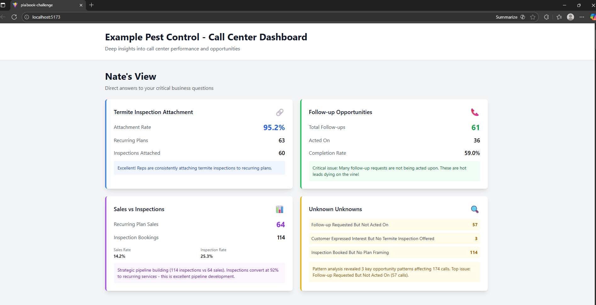

Four prominent cards that directly answer Nate's business questions:
- **Termite Inspection Attachment** (95.2% attachment rate)
- **Follow-up Opportunities** (59% completion rate - critical issue highlighted)
- **Sales vs Inspections** (64 sales vs 114 inspections)
- **Unknown Unknowns** (174 calls affected by missed opportunity patterns)

### 2. Upselling Performance

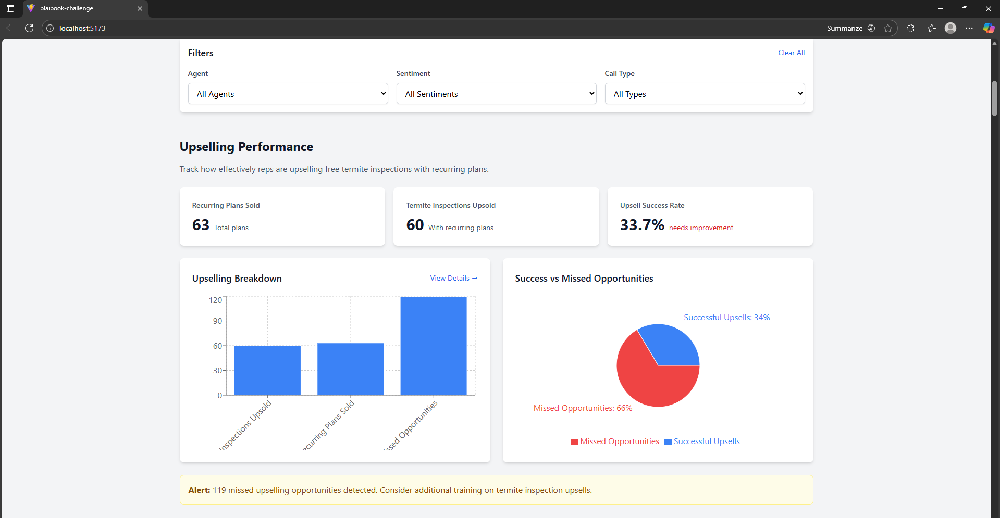

Tracks termite inspection upsells with key metrics:
- 63 recurring plans sold
- 60 termite inspections upsold
- 33.7% upsell success rate
- 119 missed opportunities identified
- Interactive charts with drill-down capability

### 3. Follow-up Opportunities

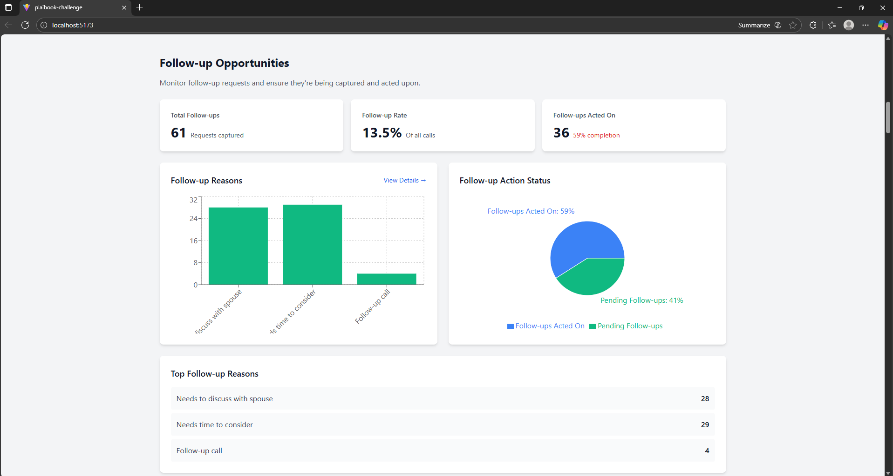

Comprehensive follow-up tracking:
- 61 follow-up requests captured
- 36 acted on (59% completion rate)
- Breakdown by reason (spouse discussion, time to consider, callback)
- Action status visualization
- Critical alert for hot leads not being acted upon

### 4. Sales vs Inspections

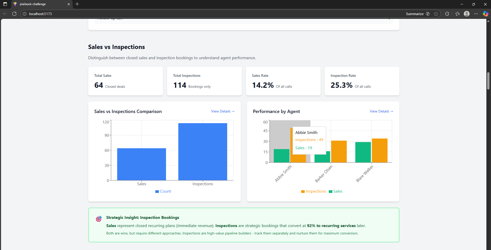

Clear distinction between immediate sales and strategic bookings:
- 64 closed deals (14.2% sales rate)
- 114 inspection bookings (25.3% inspection rate)
- Agent-level performance comparison
- Strategic insight: 92% inspection conversion rate highlighted

### 5. Revenue Impact Analysis

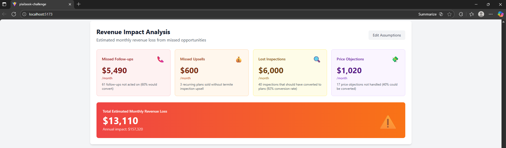

Estimated monthly revenue leakage breakdown:
- **Missed Follow-ups**: $5,490/month
- **Missed Upsells**: $600/month
- **Lost Inspections**: $6,000/month
- **Price Objections**: $1,020/month
- **Total Monthly Loss**: $13,110
- **Annual Impact**: $157,320
- Adjustable assumptions panel

### 6. Missed Opportunity Patterns

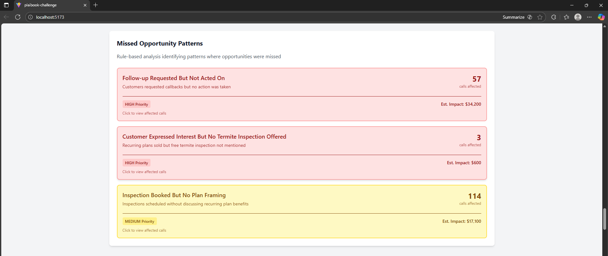

Rule-based pattern detection:
- **Follow-up Requested But Not Acted On**: 57 calls (HIGH Priority) - $34,200 impact
- **Customer Expressed Interest But No Termite Inspection**: 3 calls (HIGH Priority) - $600 impact
- **Inspection Booked But No Plan Framing**: 114 calls (MEDIUM Priority) - $17,100 impact
- Clickable patterns to view affected calls

### 7. Rep Coaching Suggestions

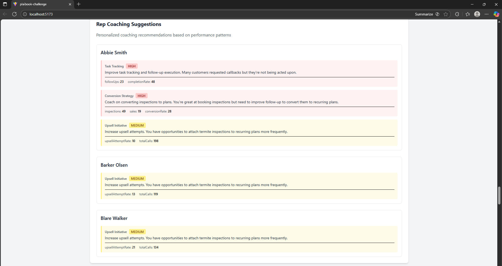

Personalized coaching recommendations per agent:
- **Abbie Smith**: Task tracking (HIGH), Conversion strategy (HIGH), Upsell initiative (MEDIUM)
- **Barker Olsen**: Upsell initiative (MEDIUM)
- **Blare Walker**: Upsell initiative (MEDIUM)
- Priority-based color coding (red for high, yellow for medium)
- Specific metrics and actionable recommendations

### 8. LLM-Powered Transcript Analysis

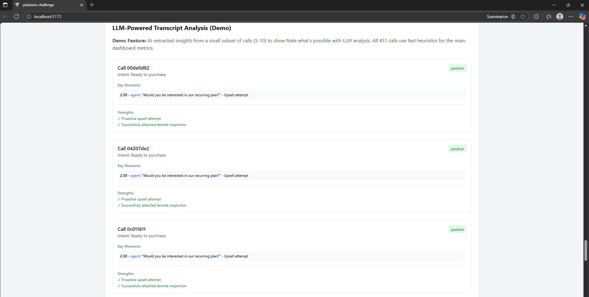

AI-extracted insights from demo subset (5-10 calls):
- Customer intent analysis
- Sentiment detection
- Key moments with timestamps
- Upsell detection
- Rep strengths and weaknesses
- Follow-up phrases and objections

### 9. Sales Pipeline Analysis

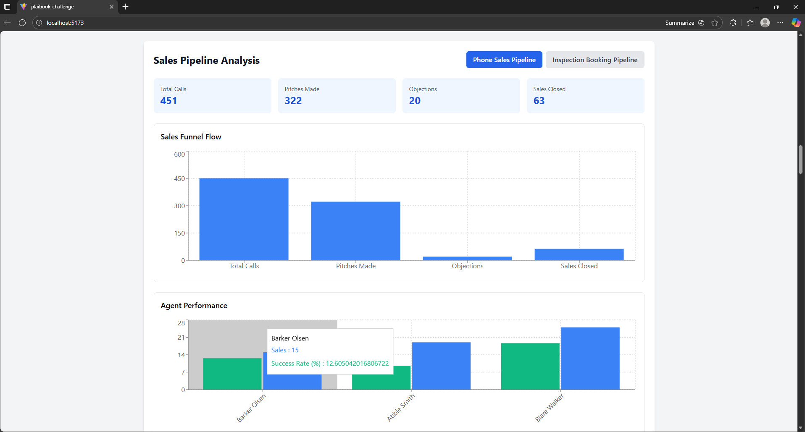

Dual pipeline view with toggle:
- **Phone Sales Pipeline**: 451 calls → 322 pitches → 20 objections → 63 sales closed
- **Inspection Booking Pipeline**: Separate funnel for strategic bookings
- Agent performance breakdown
- Funnel flow visualization

### 10. Additional Insights

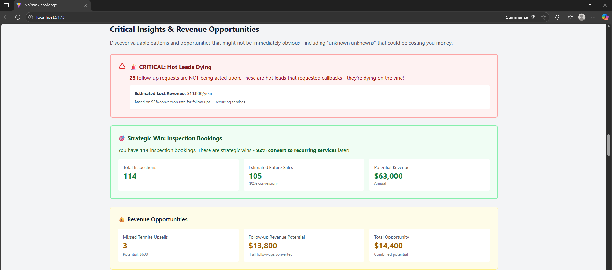

Critical insights and opportunities:
- Agent follow-up performance tracking
- Call duration patterns by type
- Top performing agents
- Strategic wins and revenue opportunities
- Color-coded priority alerts

### 11. Agent Follow-up Performance

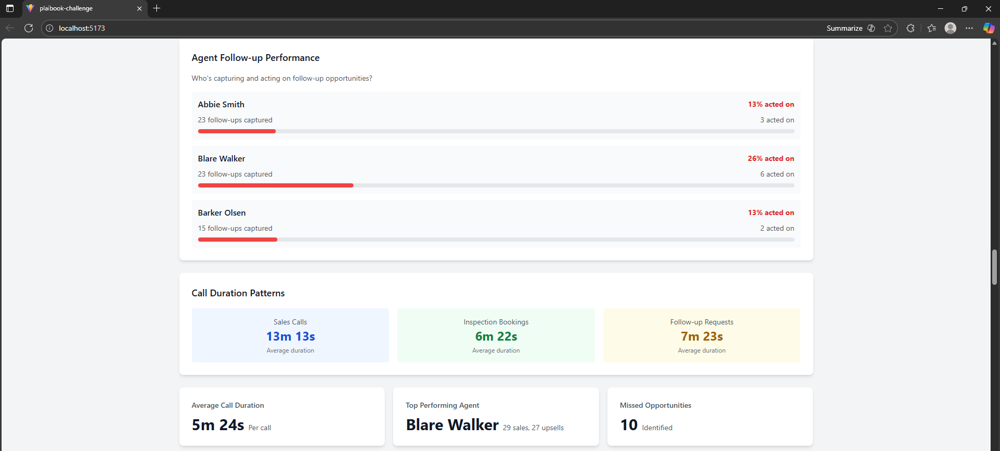

Detailed agent-level follow-up tracking:
- Individual agent follow-up capture rates
- Completion percentages with visual progress bars
- Color-coded alerts for low completion rates
- Breakdown showing who's capturing and acting on follow-up opportunities
- Helps identify agents needing coaching on follow-up discipline

### 12. Top Performing Agents

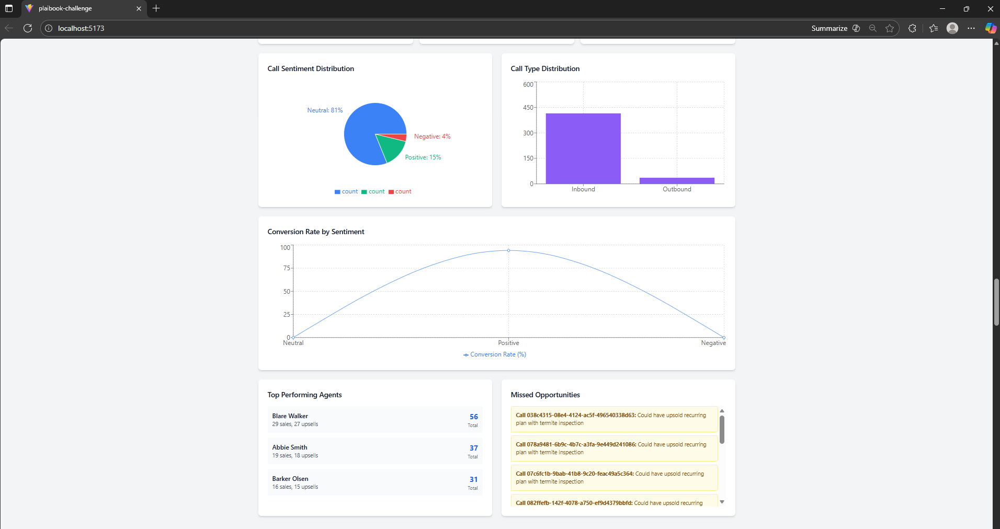

Agent performance summary:
- Top agents ranked by sales and upsells
- Total performance metrics
- Quick reference for identifying top performers
- Helps managers recognize and reward high achievers

---

> **Note**: All screenshots are stored in the `screenshots/` folder. Make sure image files are named exactly as referenced above (e.g., `nates-view.png`, `upselling-performance.png`, etc.) 


**Key Achievement**: Successfully analyzed 451 calls using heuristics, with LLM-powered insights available for demonstration. All features from the business brief have been implemented, including revenue impact analysis and comprehensive pattern mining.

---

**👨‍💻 Built by Rithish Murugan**  
**Plaibook Programming Challenge — 2025**


